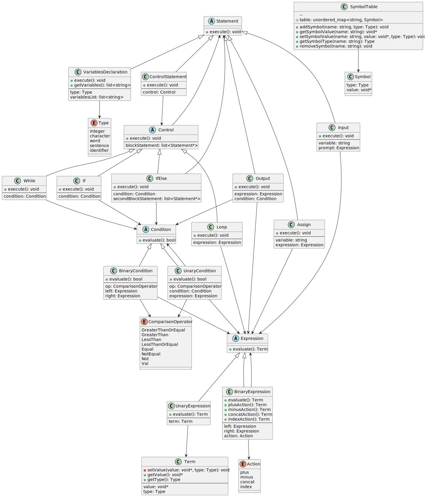

# WordLang Compiler

## Overview
WordLang is a unique language designed to facilitate manipulation of words and sentences through specialized data types and operators. This repository contains a compiler that translates WordLang code into C++.

## Features

### Data Types
- `char`: Represents a single ASCII character or can be empty (no character).
- `int`: Similar to `int` in C/C++.
- `word`: Represents a single word, defined as a sequence of characters without white-space.
- `sentence`: Represents a sentence, defined as a sequence of words possibly separated by white-spaces and terminated by a newline ('\n').

### Literals
- `char`: Represented as 'x' (as in C/C++), with an empty char being ‘\0’.
- `word`: Represented as "xxx..." (as a string literal is in C/C++), with an empty word being "".
- `sentence`: Represented as ^xxxx xxxx xxxx^ (the newline is implied), with an empty sentence being ^^ (only has newline).
- `int`: Represented as an integer number (as in C/C++).

### Variable Definition
Variables are defined using the following syntax:

```
<type> <variable_name>[, <variable_name>...];
```


For example:
```WordLang
word w;
sentence s, s2;
int i, j;
```

### Operators
WordLang includes a set of operators designed for manipulating its unique data types:

| Operator | Function                                                                                             | Priority (Low to High) |
| -------- | ---------------------------------------------------------------------------------------------------- | ---------------------- |
| =        | Assignment: assign a value to a variable (as in C/C++).                                                      | 4, right-left          |
| -        | Decrement: remove a character from a word or sentence, or remove a word from a sentence. Subtract for `int`. | 3, left-right          |
| +        | Addition for `int`.                                                                                  | 3, left-right          |
| #        | Concatenate: concatenate characters to form a word; concatenate words to form a sentence.           | 3, left-right          |
| :        | Indexing: extract a letter from a word; extract a word from a sentence.                              | 2, left-right          |
| (…)      | Parenthesis (as in C/C++).                                                                           | 1                       |

### Control Structures
- `if (<condition>) <Sentence> | <Block>`: Executes `<Sentence>` or `<Block>` if `<condition>` is true.
- `if (<condition>) <Sentencet> | <Blockt> else <Sentencef> | <Blockf>`: Executes `<Sentencet>` or `<Blockt>` if `<condition>` is true, otherwise executes `<Sentencef>` or `<Blockf>`.
- `while (<condition) <Sentence> | <Block>`: Repeatedly executes `<Sentence>` or `<Block>` while `<condition>` is true.
- `loop (<int>) <Sentence> | <Block>`: Repeatedly executes `<Sentence>` or `<Block>` a specified `<int>` number of times.

### Input/Output
- `input <prompt-value> <var>`: Outputs the `<prompt-value>` and stores the user's input in variable `<var>`.
- `output <expression>`: Evaluates and outputs `<expression>`.

## Examples
```WordLang
"Hello"#"World"         ➔      "HelloWorld"
^Hello^#"World"         ➔      ^Hello World^
"Hello"#"World":1       ➔      "Helloo"
("Hello"#"World"):7     ➔      'r'
("Hello"#"World"):-1    ➔      'd'
(^Hello^#"World"):1     ➔      "World"
"Hello"#"World"-'l'     ➔      "HeloWorld"
"Hello"#("World"-'l')   ➔      "HelloWord"


sentence s1;
s1 = ^We live in a^;
output s1#^World^       ➔      Outputs: We live in a World
s1 = s1#"wonderful"#"world"#'!'
output s1               ➔      Outputs: We live in a wonderful world!
output s1-"wonderful"   ➔      Outputs: We live in a world!
output s1-'w'           ➔      Outputs: We live in a onderful world!
```


## Getting Started

### Prerequisites

Make sure the following tools are installed on your system:

* `g++` (C++14)
* `bison`
* `flex`

You can install them on Ubuntu/Debian with:

```bash
sudo apt update
sudo apt install g++ bison flex
```

### Installation

Clone the repository:

```bash
git clone https://github.com/ibrahim-al-nakeeb/WordLang-Compiler.git
cd WordLang-Compiler
```

Build the compiler using:

```bash
make
```

### Usage

To compile a WordLang program, run:

```bash
bin/wordlang path/to/code.wl
```

This will generate a C++ file.

To compile it into an executable and execute the compiled script:

```bash
make run
```

## Class Diagram

The diagram below outlines the structure of the compiler. The class hierarchy may look a bit complex at first glance, but it’s designed to keep the logic modular and extendable — especially when handling different expression and statement types.



## Notes

This project was built to experiment with compiler design, language parsing, and operator overloading in C++. The inheritance model might seem deep, but it makes adding new language features a lot cleaner once you get the flow.

Feel free to clone, mess around, and improve it.
PRs and issues are welcome.
Happy compiling! 🚀